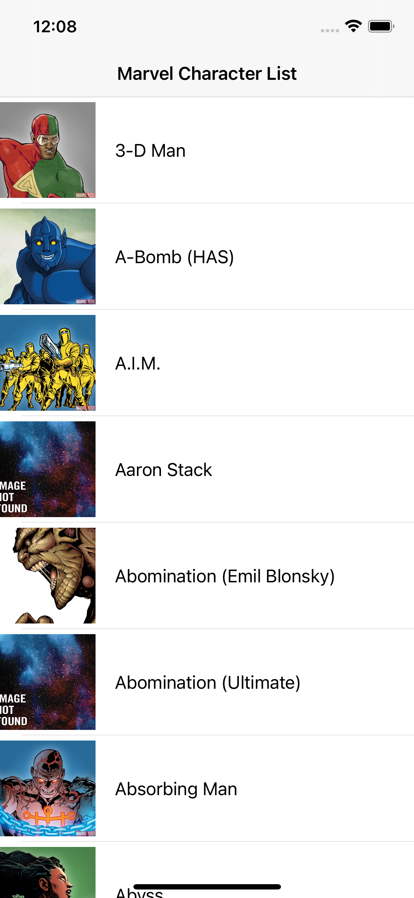
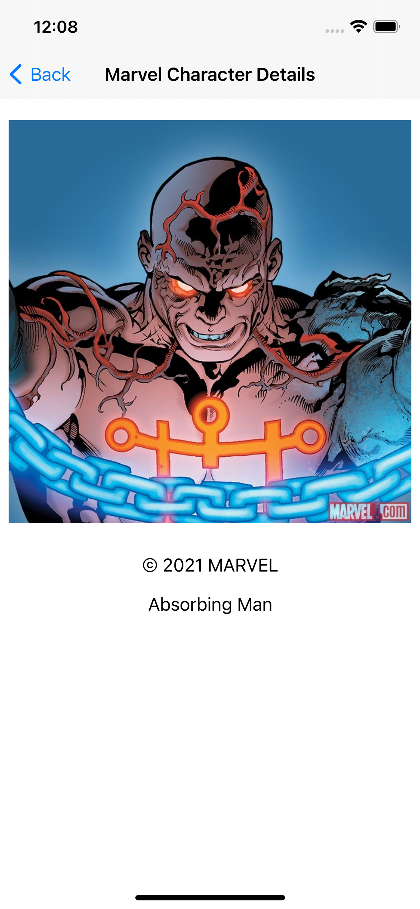
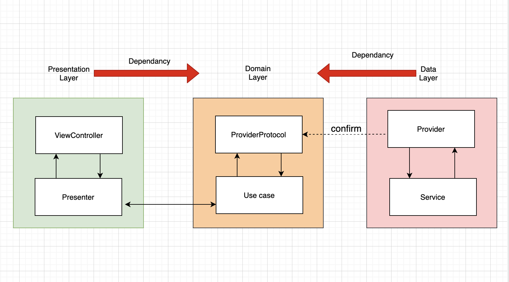

# Marvel
# Marvel POC
The purpose of this document is to explain the architecture of application.

Below is running app screenshots:



## Table of Contents
1. [Architecture]
2. [Implementation]
3. [Testing]
4. [Project Setup]


## 1. Architecture
We divided the app code into different folder which act as logical units. Each unit have their own responsibility and behaviour. All components communication is done using abstraction. 
This app divided into below folder structure:
This diagram will illustrate high level implementation of architecture


* [**Presentation**]
Responsible to handle all user events on view.
It consist below things:
[**Builder**]: Builder is responsible to inject dependancy between presenter and view. 
[**Presenter**]: It is responsible to update the result of business logic to viewController. this update is handled using state.
[**ViewController**]: It links the user controls to update them when needed. View will inform presenter about user action.
[**ViewModel**]: It consist the UI view model data which is useful to render on the view.

* [**Domain**]
Handler of all business logic and models.
It consist below things:
[**Models**]: Models are Entities domain model representation.
[**UseCases**]: It is responsible to handle use case and business logic. Protocols and their implementations to represent business logics
[**ProviderProtocols**]: These are Protocol which can be confirmed in data layer.

* [**Data**]
Responsible to retrieve all the data required by the application. Source of this data can be from remote or from local.
It consist below things:
[**Entities**]: It defines to fit API needs
[**Services**]: Service layer is an abstraction layer on top Moya
[**Providers**]: It handle the services and retrieve the services response which are represented in Entities.

## 2. Implementation
To develop this POC, we used MVP-CLEAN architecture.
We divided the code into logical units and each logical units have different-different responsibilities. 

**DependancyManager**
Responsible to provide objects of dependable classes.

**Router**
Responsible to route from one ViewController to another ViewController 

**Networking**
Responsible to handle all API request. It is abstraction layer on top of [Moya](https://github.com/Moya/Moya).  

## 3. Testing
* Under Data module, we have written unit test cases for Entities, and Providers.
* Under Domain module, we have written unit test cases for Models, and UseCases.
* Under Presentation module, we have written unit test cases for Builders, and Presenters.


## 4. Project Setup
To run this POC on local machine follow below steps:

The following will generate the local Marvel.xcodeproj directory

```bash
xcodegen generate
```
* Open Marvel.xcodeproj file and wait till required swift packages loading done.
